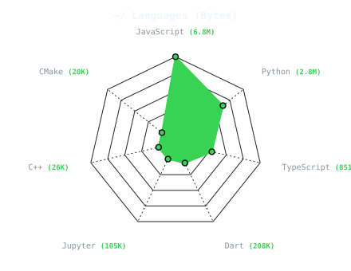
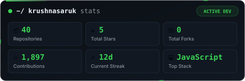
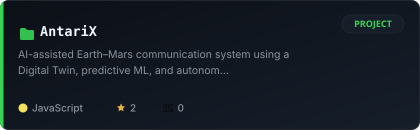
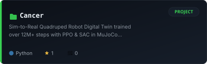
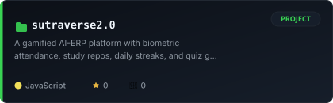
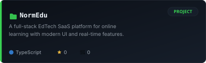
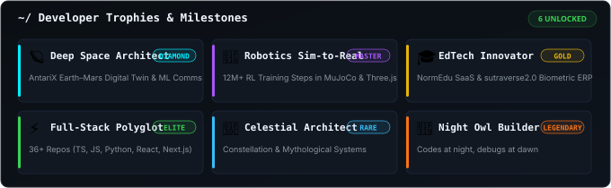

<table>
<tr>
<td width="30%" align="center" valign="middle">
  
</td>
<td width="70%" valign="middle">

### `~/` Krushna Pralhad Saruk

> *"CS student who codes at night and debugs at dawn. Building deep-space digital twins, reinforcement learning robotics controllers, and modern SaaS platforms."*

- 🪐 **Current Focus**: **[AntariX](https://github.com/krushnasaruk/AntariX)** (Earth–Mars autonomous comms) & **[Cancer](https://github.com/krushnasaruk/Cancer)** (Sim-to-Real quadruped)
- 🌐 **Portfolio**: **[krushnasaruk.in](https://krushnasaruk.in)** &nbsp;|&nbsp; ⚡ **Specialties**: Full-Stack, RL & Robotics Sim

  
  
  
  
  

</td>
</tr>
</table>

---

## `~/` radar

<table>
<tr>
<td width="50%" align="center">

<picture>
  <source media="(prefers-color-scheme: dark)"  srcset="assets/radar-dark.svg">
  <source media="(prefers-color-scheme: light)" srcset="assets/radar-light.svg">
  
</picture>

</td>
<td width="50%" align="center">

<picture>
  <source media="(prefers-color-scheme: dark)"  srcset="assets/radar-langs-dark.svg">
  <source media="(prefers-color-scheme: light)" srcset="assets/radar-langs-light.svg">
  
</picture>

</td>
</tr>
</table>

---

## `~/` contribution graph

<picture>
  <source media="(prefers-color-scheme: dark)"  srcset="assets/isometric-calendar-dark.svg">
  <source media="(prefers-color-scheme: light)" srcset="assets/isometric-calendar-light.svg">
  
</picture>

---

## `~/` stats

<picture>
  <source media="(prefers-color-scheme: dark)"  srcset="assets/stats-dark.svg">
  <source media="(prefers-color-scheme: light)" srcset="assets/stats-light.svg">
  
</picture>

---

## `~/` featured projects

<table>
<tr>
<td width="50%">
<a href="https://github.com/krushnasaruk/AntariX">
<picture>
  <source media="(prefers-color-scheme: dark)"  srcset="assets/card-AntariX-dark.svg">
  <source media="(prefers-color-scheme: light)" srcset="assets/card-AntariX-light.svg">
  
</picture>
</a>
</td>
<td width="50%">
<a href="https://github.com/krushnasaruk/Cancer">
<picture>
  <source media="(prefers-color-scheme: dark)"  srcset="assets/card-Cancer-dark.svg">
  <source media="(prefers-color-scheme: light)" srcset="assets/card-Cancer-light.svg">
  
</picture>
</a>
</td>
</tr>
<tr>
<td width="50%">
<a href="https://github.com/krushnasaruk/sutraverse2.0">
<picture>
  <source media="(prefers-color-scheme: dark)"  srcset="assets/card-sutraverse2.0-dark.svg">
  <source media="(prefers-color-scheme: light)" srcset="assets/card-sutraverse2.0-light.svg">
  
</picture>
</a>
</td>
<td width="50%">
<a href="https://github.com/krushnasaruk/NormEdu">
<picture>
  <source media="(prefers-color-scheme: dark)"  srcset="assets/card-NormEdu-dark.svg">
  <source media="(prefers-color-scheme: light)" srcset="assets/card-NormEdu-light.svg">
  
</picture>
</a>
</td>
</tr>
</table>

---

## `~/` achievements

<picture>
  <source media="(prefers-color-scheme: dark)"  srcset="assets/achievements-dark.svg">
  <source media="(prefers-color-scheme: light)" srcset="assets/achievements-light.svg">
  
</picture>

---

01100010 01110101 01101001 01101100 01100100 00100000 01110011 01101111 01101101 01100101 01110100 01101000 01101001 01101110 01100111 00100000 01110111 01101111 01100100 01110100 01101000 00100000 01101100 01101111 01101111 01101011 01101001 01101110 01100111 00100000 01100001 01110100

