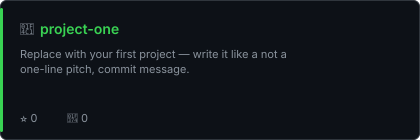
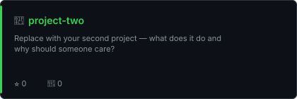
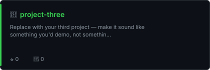
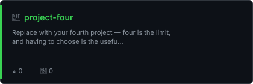

<div align="center">

<!-- ═══════════════════════════════════════════════════════════ -->
<!-- DOT-MATRIX PORTRAIT (color mode — works on both themes)    -->
<!-- ═══════════════════════════════════════════════════════════ -->


<br><br>

<!-- ═══════════════════════════════════════════════════════════ -->
<!-- TYPING BANNER                                              -->
<!-- ═══════════════════════════════════════════════════════════ -->


<br>

<!-- ═══════════════════════════════════════════════════════════ -->
<!-- SOCIAL BADGES                                              -->
<!-- ═══════════════════════════════════════════════════════════ -->

<a href="https://krushnasaruk.in"></a>

<br><br>


</div>

---

## `~/` whoami

```console
$ cat about.txt
```

Hi, I'm **Krushna Pralhad Saruk**. CS student who codes at night and debugs at dawn.

- 🔭 Currently building **something cool** <!-- update this! -->
- 🌐 Portfolio: **[krushnasaruk.in](https://krushnasaruk.in)**
- 🌱 Learning **full-stack development with React & Node.js**
- ⚡ Fun fact: **I think semicolons are optional (don't @ me)**

---

## `~/` toolbox

<div align="center">


</div>

---

## `~/` radar

<table>
<tr>
<td width="50%" align="center">

<picture>
  <source media="(prefers-color-scheme: dark)"  srcset="assets/radar-dark.svg">
  <source media="(prefers-color-scheme: light)" srcset="assets/radar-light.svg">
  
</picture>

<sub>what I think I know</sub>

</td>
<td width="50%" align="center">

<picture>
  <source media="(prefers-color-scheme: dark)"  srcset="assets/radar-langs-dark.svg">
  <source media="(prefers-color-scheme: light)" srcset="assets/radar-langs-light.svg">
  
</picture>

<sub>what GitHub says I write</sub>

</td>
</tr>
</table>

---

## `~/` contribution calendar

<div align="center">

<picture>
  <source media="(prefers-color-scheme: dark)"  srcset="assets/metrics.isometric-dark.svg">
  <source media="(prefers-color-scheme: light)" srcset="assets/metrics.isometric-light.svg">
  
</picture>

<br>

<picture>
  <source media="(prefers-color-scheme: dark)"  srcset="https://raw.githubusercontent.com/krushnasaruk/krushnasaruk/output/snake-dark.svg">
  <source media="(prefers-color-scheme: light)" srcset="https://raw.githubusercontent.com/krushnasaruk/krushnasaruk/output/snake-light.svg">
  
</picture>

</div>

---

## `~/` stats

<div align="center">

<picture>
  <source media="(prefers-color-scheme: dark)"  srcset="assets/stats-dark.svg">
  <source media="(prefers-color-scheme: light)" srcset="assets/stats-light.svg">
  
</picture>

</div>

---

## `~/` projects

<!-- ═══════════════════════════════════════════════════════════ -->
<!-- Replace project-one through project-four with your repos   -->
<!-- Update assets/projects.json too, then re-run cards.py      -->
<!-- ═══════════════════════════════════════════════════════════ -->

<table>
<tr>
<td width="50%">
<a href="https://github.com/krushnasaruk/project-one">
<picture>
  <source media="(prefers-color-scheme: dark)"  srcset="assets/card-project-one-dark.svg">
  <source media="(prefers-color-scheme: light)" srcset="assets/card-project-one-light.svg">
  
</picture>
</a>
</td>
<td width="50%">
<a href="https://github.com/krushnasaruk/project-two">
<picture>
  <source media="(prefers-color-scheme: dark)"  srcset="assets/card-project-two-dark.svg">
  <source media="(prefers-color-scheme: light)" srcset="assets/card-project-two-light.svg">
  
</picture>
</a>
</td>
</tr>
<tr>
<td width="50%">
<a href="https://github.com/krushnasaruk/project-three">
<picture>
  <source media="(prefers-color-scheme: dark)"  srcset="assets/card-project-three-dark.svg">
  <source media="(prefers-color-scheme: light)" srcset="assets/card-project-three-light.svg">
  
</picture>
</a>
</td>
<td width="50%">
<a href="https://github.com/krushnasaruk/project-four">
<picture>
  <source media="(prefers-color-scheme: dark)"  srcset="assets/card-project-four-dark.svg">
  <source media="(prefers-color-scheme: light)" srcset="assets/card-project-four-light.svg">
  
</picture>
</a>
</td>
</tr>
</table>

<sub>

| Project | Stack | Link |
|---------|-------|------|
| **project-one** | — | [repo](https://github.com/krushnasaruk/project-one) |
| **project-two** | — | [repo](https://github.com/krushnasaruk/project-two) |
| **project-three** | — | [repo](https://github.com/krushnasaruk/project-three) |
| **project-four** | — | [repo](https://github.com/krushnasaruk/project-four) |

</sub>

---

## `~/` achievements

<div align="center">

<picture>
  <source media="(prefers-color-scheme: dark)"  srcset="assets/metrics.achievements.svg">
  <source media="(prefers-color-scheme: light)" srcset="assets/metrics.achievements.svg">
  
</picture>

</div>

---

<div align="center">

<sub>01100010 01110101 01101001 01101100 01100100 00100000 01110011 01101111 01101101 01100101 01110100 01101000 01101001 01101110 01100111 00100000 01110111 01101111 01110010 01110100 01101000 00100000 01101100 01101111 01101111 01101011 01101001 01101110 01100111 00100000 01100001 01110100</sub>

</div>
